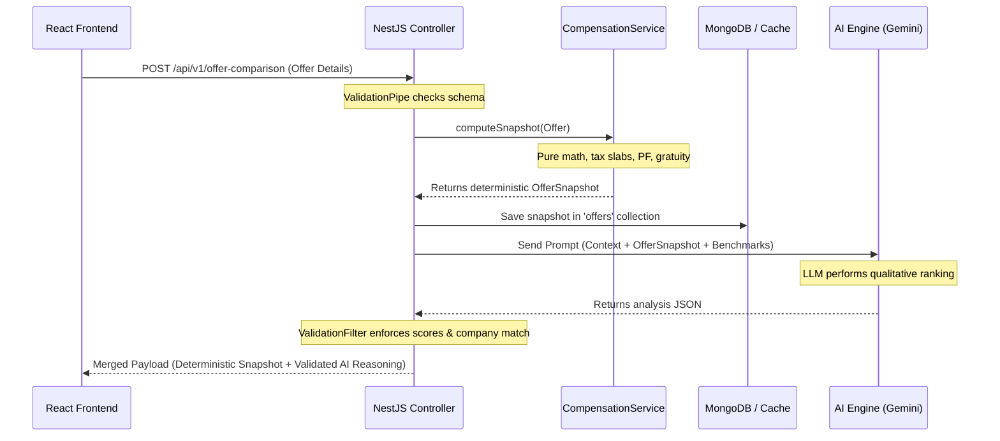

# Security Policy — Comp Copilot

Comp Copilot is built with security as a primary design constraint. This document provides a comprehensive breakdown of the application's security architecture, JWT session lifecycle, secret management strategy, and the strict **AI Trust Boundary**. It also documents the findings from our security review of the active codebase and lists actionable production hardening recommendations.

---

## 1. Architectural Security & The AI Trust Boundary

The core security principle of Comp Copilot is the **prevention of AI hallucinations in financial calculations**. Financial calculations (CTC adjustments, tax computations, PF contributions, gratuity, and cost-of-living adjustments) have real-world consequences and must be 100% deterministic.

> [!IMPORTANT]
> **The LLM (Gemini/Claude) is strictly an analytical engine. It reasons and explains over deterministic figures, but it NEVER originates, computes, or alters financial data.**

### Enforcement Flow


### Safety Controls
1. **Deterministic Computation First**: All financial logic resides in [CompensationService](file:///Users/calibraint_1/Documents/personal-tools/comp-copilot/backend/src/core/compensation/compensation.service.ts) as pure, synchronously testable functions.
2. **Snapshot-Driven Prompts**: The AI prompt includes the already-computed `OfferSnapshot`. The LLM is never given raw variables to perform arithmetic.
3. **Response Schema Validation**: The AI response is parsed and validated by the backend [OfferComparisonService](file:///Users/calibraint_1/Documents/personal-tools/comp-copilot/backend/src/features/offer-comparison/offer-comparison.service.ts):
   - All scores must be integers strictly within `0–100`.
   - Percentage breakdowns must sum to `100 ± 1`.
   - The selected `bestOffer` must match one of the candidate company names exactly.
4. **Fail-Closed Filter**: If the AI response fails validation or is malformed, [AiExceptionFilter](file:///Users/calibraint_1/Documents/personal-tools/comp-copilot/backend/src/shared/filters/ai-exception.filter.ts) intercepts the error, logs the raw output, and returns an HTTP `502 Bad Gateway`. No raw or unvalidated AI output ever reaches the client.

### Local LLM Execution via Ollama for Data Privacy

To support environments with strict data privacy guidelines, Comp Copilot offers integration with **Ollama** for running LLMs locally.

- **Zero-Cloud Trust Model**: For users or organizations where salary data, offer terms, or company evaluations cannot be sent to third-party providers (like Google Gemini, Anthropic Claude, or OpenAI), Ollama executes open models (such as `llama3` or `gemma`) entirely on the local development or hosting machine.
- **No Data Shared with External Vendors**: Data never leaves the trust boundary of the local server. Prompts, numerical computations, and evaluations remain local and private, avoiding API logging or model-training telemetry by external cloud vendors.
- **Configuration**: Set `AI_PROVIDER=ollama` in the backend environment configuration to automatically route supported AI processes through the local Ollama instance.

---

## 2. Authentication & Session Lifecycle

Comp Copilot implements a secure stateless authentication mechanism designed to minimize the client-side attack surface.

### Token Issuance
Tokens are issued by the [AuthService](file:///Users/calibraint_1/Documents/personal-tools/comp-copilot/backend/src/features/auth/auth.service.ts) after verifying the email and password hash.
- **Hashing**: Passwords are encrypted using `bcryptjs` with **12 salt rounds** (~250ms computation delay per check to prevent offline brute-forcing).
- **Payload**: The token payload contains only the user ID (`sub`) and the email.
- **Verification**: A global [JwtAuthGuard](file:///Users/calibraint_1/Documents/personal-tools/comp-copilot/backend/src/shared/guards/jwt-auth.guard.ts) intercepts and validates incoming requests. Routes can explicitly opt out using the `@Public()` decorator.

### In-Memory Token Storage (Hard Constraint)
To mitigate Cross-Site Scripting (XSS) attacks, Comp Copilot implements a strict client-side storage policy:

> [!WARNING]
> **JWT Access Tokens live strictly in React memory state.**
> The token is never stored in `localStorage`, `sessionStorage`, or `IndexedDB`.

- **Security Benefit**: Browser storage APIs are globally accessible to any script running on the origin (including malicious third-party scripts or XSS payloads). By keeping the token in local React memory state ([AuthContext.tsx](file:///Users/calibraint_1/Documents/personal-tools/comp-copilot/web/src/context/AuthContext.tsx)), the token is purged immediately when the page is reloaded, making token extraction much more difficult.
- **UX Trade-off**: Refreshing the browser or opening the app in a new tab terminates the session, requiring the user to log in again.
- **API Fetch Wrapper**: The frontend uses a custom hook [useApiFetch.ts](file:///Users/calibraint_1/Documents/personal-tools/comp-copilot/web/src/hooks/useApiFetch.ts) to inject the `Authorization: Bearer <token>` header dynamically and automatically signs the user out if a `401 Unauthorized` response is received.

---

## 3. Secret Management & Environment Isolation

All sensitive configurations and credentials are kept strictly isolated from the source code.

| Environment Variable | Purpose | Scope | Actionable Security |
| :--- | :--- | :--- | :--- |
| `JWT_SECRET` | Cryptographically signs and verifies JWT tokens. | Backend | Must be a high-entropy string (e.g. 256-bit). |
| `MONGODB_URI` | Standard URI containing MongoDB credentials. | Backend | Must restrict database privileges to minimum required. |
| `GEMINI_API_KEY` | Auths the backend to Google Gemini AI API. | Backend | Free tier restrictions apply (15 RPM). |
| `ADMIN_TOKEN` | Authorizes administrative task invocations. | Backend | Used to refresh city and company metadata. |
| `ALLOWED_ORIGIN` | Defines the permitted CORS source. | Backend | Restricts domain access in production. |

### Environment Isolation Rules
- **No Hardcoded Secrets**: Secrets are never hardcoded or committed to git.
- **Example Environments**: The repository contains `.env.example` templates containing safe mock variables.
- **Git Ignore**: The actual `.env` file is explicitly ignored in [.gitignore](file:///Users/calibraint_1/Documents/personal-tools/comp-copilot/.gitignore). Run this command to verify isolation:
  ```bash
  git check-ignore -v backend/.env
  ```

---

## 4. Input Validation & Request Sanitization

All incoming HTTP requests are validated at the entry boundary before executing controller logic.

- **Class Validators**: Request DTOs are annotated with `class-validator` decorators (e.g. `@IsEmail()`, `@IsString()`, `@MaxLength(200)`).
- **NestJS ValidationPipe**: Configured globally in [main.ts](file:///Users/calibraint_1/Documents/personal-tools/comp-copilot/backend/src/main.ts):
  ```typescript
  app.useGlobalPipes(
    new ValidationPipe({ whitelist: true, forbidNonWhitelisted: true }),
  );
  ```
  This automatically strips non-whitelisted properties and rejects requests containing unexpected parameters (combating parameter pollution).
- **Injection Mitigation**: Mongoose parameterized queries prevent NoSQL injections. The application does not use dynamic query construction or `$where` operators containing user input.
- **XSS Mitigation**: The backend API returns structured JSON, not HTML. The React frontend escapes interpolated content by default in JSX and avoids the use of `dangerouslySetInnerHTML`.

---

## 5. Security Code Audit: Findings & Remediations

During our review of the application source code, we identified two notable security anomalies.

### Finding 1: Rate Limiter Error Message Discrepancy (Medium Priority)
In the backend, the rate limiting throttler is configured to allow `3 requests per 60 seconds` (1 minute) for AI routes:
- **Configuration ([app.module.ts](file:///Users/calibraint_1/Documents/personal-tools/comp-copilot/backend/src/app.module.ts))**:
  ```typescript
  ThrottlerModule.forRoot([{ name: 'ai', ttl: 60_000, limit: 3 }])
  ```
- **Error Response ([ai-throttler.guard.ts](file:///Users/calibraint_1/Documents/personal-tools/comp-copilot/backend/src/shared/guards/ai-throttler.guard.ts))**:
  ```typescript
  protected async getErrorMessage(): Promise<string> {
    return 'AI rate limit exceeded: maximum 3 requests per hour. Please try again later.';
  }
  ```
- **Risk**: The warning message is misleading to users, stating that the limit is per hour, when it is actually enforced per minute.
- **Remediation**: Update the error message in the guard to read `"AI rate limit exceeded: maximum 3 requests per minute. Please try again later."` to match the configuration.

### Finding 2: Admin Endpoint Timing Attack Risk (Low Priority)
Admin endpoints (e.g. `/api/v1/city-expenses/refresh`) are protected by [AdminGuard](file:///Users/calibraint_1/Documents/personal-tools/comp-copilot/backend/src/shared/guards/admin.guard.ts), which performs a standard string equality comparison:
- **Code**:
  ```typescript
  return req.headers['x-admin-token'] === adminToken;
  ```
- **Risk**: Standard string comparison evaluates characters sequentially and returns `false` on the first mismatch. This introduces a slight time variance (timing side-channel) that can theoretically allow an attacker to reconstruct the token character by character.
- **Remediation**: Use Node's built-in `crypto.timingSafeEqual` to enforce constant-time string comparison:
  ```typescript
  import { timingSafeEqual } from 'crypto';
  
  const bufA = Buffer.from(req.headers['x-admin-token'] as string);
  const bufB = Buffer.from(adminToken);
  if (bufA.length !== bufB.length) return false;
  return timingSafeEqual(bufA, bufB);
  ```

---

## 6. Security Threat Matrix

| Threat vector | Severity | Mitigation implemented | Future work |
| :--- | :--- | :--- | :--- |
| **XSS & Session Hijacking** | High | In-memory token storage prevents script-based token extraction. | Implement HttpOnly cookies with Refresh Token rotation. |
| **NoSQL Injection** | High | Mongoose queries are parameterized. | Integrate MongoDB query sanitizers. |
| **AI Prompt Injection / Manipulation** | Medium | Validation filters intercept and reject bad responses at the API boundary. | Implement adversarial prompt templates and input safety checks. |
| **Auth Brute Force** | Medium | Hashing cost (12 rounds) slows down computations. | Implement IP-based lockout limits on auth endpoints. |
| **CSRF** | Low | CORS configurations restrict accepted HTTP origins. | Include Anti-CSRF double-submit cookies. |

---

## 7. Production Hardening Checklist

Ensure all items on this checklist are checked before deploying the application to production:

- [ ] **Secrets Management**: Generate high-entropy keys for `JWT_SECRET` and `ADMIN_TOKEN` via `openssl rand -hex 32`.
- [ ] **CORS Restrictions**: Set `ALLOWED_ORIGIN` to the exact frontend domain name (e.g., `https://copilot.yourdomain.com`). Never use `*` in production.
- [ ] **Infrastructure Isolation**: Ensure MongoDB and Redis containers do not expose ports (`27017` / `6379`) to the public internet. Access should be restricted to the internal Docker network.
- [ ] **Reverse Proxy SSL/TLS**: Terminate HTTPS at the Nginx, Traefik, or Cloudflare level. Configure secure TLS protocols (TLS 1.2, 1.3) and redirect HTTP to HTTPS.
- [ ] **Container Security**: Run Docker containers as non-root users.
- [ ] **API Security Headers**: Integrate security middleware such as `helmet` in NestJS to automatically set HTTP headers (`X-Content-Type-Options`, `Content-Security-Policy`, `Strict-Transport-Security`).
- [ ] **Prometheus Security**: Block external access to the `/metrics` endpoint on the public reverse proxy.
